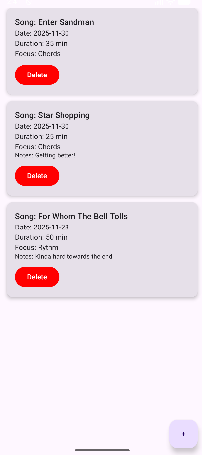
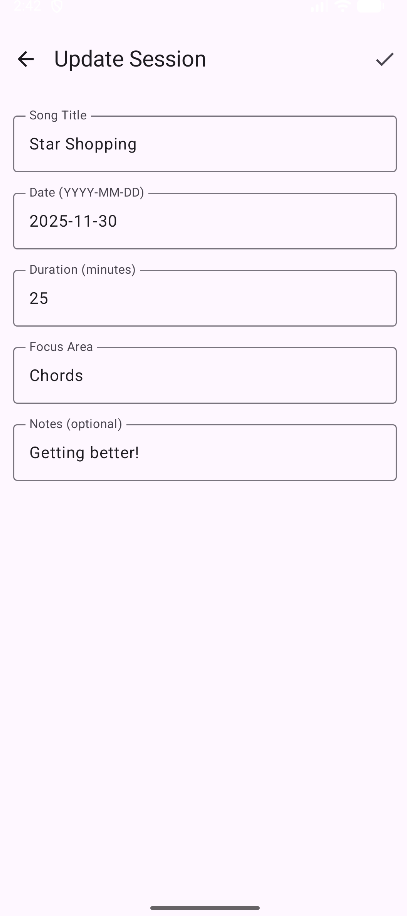
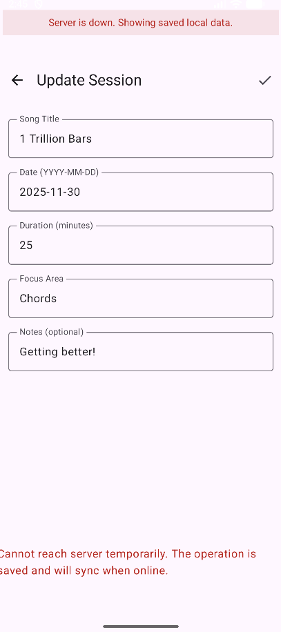

# 🎸 Guitar Practice Log - Mobile App

A project built with **Kotlin Multiplatform** for cross-platform UI and **native Android/Kotlin** for the full app, paired with a **Spring Boot + JPA + Hibernate** server.  
It tracks guitar practice sessions with full offline support and automatic synchronization to the custom REST server.

## 📖 Assignment / Course Requirements

The project follows the requirements laid out by the course instructor; see full lab plan [here](https://www.cs.ubbcluj.ro/~dan/ma/labPlan.html)

---

## 📸 App Mockups

### Practice List View



### Edit Form



### Edit Form (Offline)



---

## 📌 Overview

The **Guitar Practice Log App** is a simple, intuitive tool for guitar players who want to keep track of their practice sessions. Each session includes:

* Song title
* Date
* Duration
* Focus area (e.g., rhythm, chords, solo)
* Optional notes

The app works **fully offline** and automatically synchronizes all changes with a remote server when the device reconnects.

---

## 🧩 Core Features

### ✔ CRUD for Practice Sessions

Each **PracticeSession** contains:

| Field              | Type    | Description                                 |
| ------------------ | ------- | ------------------------------------------- |
| ID                 | Integer | Unique identifier (server/local DB managed) |
| Song Title         | Text    | Song or exercise practiced                  |
| Date               | Date    | Practice day                                |
| Duration (minutes) | Number  | Session length                              |
| Focus Area         | Text    | Main skill trained                          |
| Notes              | Text    | Optional notes                              |

### CRUD Behavior

* **Create:** Add a new practice session using a dedicated form with full field labels and validation.
* **Read:** All session details are displayed directly in the list.
* **Update:** Tapping a session opens the edit form, where all fields are pre-populated and can be modified.
* **Delete:** Remove a session using a confirmation dialog; the item is properly identified by its ID.

---

## 📴 Full Offline Support

All operations work offline and survive app restarts:

| Operation | Offline Behavior                                                                 |
| --------- | --------------------------------------------------------------------------------- |
| Create    | User is notified that the server is offline; the new session is saved locally and queued for sync. |
| Read      | Local cached data is displayed, along with a notice that the server is offline.   |
| Update    | User is notified that the server is offline; changes are saved locally and queued as “Pending Update.” |
| Delete    | User is notified that the server is offline; the item is removed locally and queued as “Pending Deletion.” |


### 🔄 Automatic Sync on Reconnection

When connection returns:

* All pending creates/updates/deletes sync to the server
* Conflicts are detected & resolved directly
* Local DB is refreshed to match server state

### 🎯 Bonus Feature Implemented

**Advanced Background Sync using WorkManager**

* Ensures robust syncing even after app closures or long offline periods
* Handles retries & linear backoff

---

## 🌐 Server Integration

The server is **implemented manually** using **Spring Boot**, **JPA**, and **Hibernate** (no Firebase, no serverless platforms).
Communication uses **REST + WebSockets**:

* **REST** -> main CRUD operations
* **WebSocket** -> real-time updates pushed to the Android client
* Both the client and server include **full debug logging**

---

## 📁 Project Structure

```
root
├── idea/                          # App concept and domain documentation
├── non-native/                    # Kotlin Multiplatform UI-only version
│   └── (KMP UI CRUD with list, create, update, delete)
├── native/                        # Full Android implementation
│   ├── frontend/                  # Android client
│   │   • Local DB (Room)
│   │   • Repository layer
│   │   • Offline caching
│   │   • WorkManager background sync
│   │   • REST client + WebSocket client
│   └── backend/                   # Spring Boot server (REST + WebSockets, JPA + Hibernate)
└── README.md                      # Project documentation
```

---

## 🏆 Evaluation Criteria (All Achieved at “Excellent”)

> **Project evolution note:**
>
> * The **non-native Kotlin Multiplatform module** includes **only the UI-only version** (list, create, update, delete).
> * The **native Android module** evolved through **three complete stages**:
>   **UI-only → Local Database → Full Server Integration (REST + WebSockets + Offline Sync)**.

---

### 1. **Kotlin Multiplatform – UI-only Version**

* ✔ Recycler/list view with ViewModel + repository
* ✔ No full list/adapter rebuilds
* ✔ Dedicated screens for create & update
* ✔ Field labels, validation, correct pre-population
* ✔ Delete with confirmation

---

### 2. **Native Android – Local Database Version**

* ✔ Values retrieved once, observed via LiveData/Flow
* ✔ Clean repository pattern + background coroutines
* ✔ DB-managed IDs (user never sees internal ID)
* ✔ Update reuses the same DB entity (no delete-and-recreate)
* ✔ Persistence errors shown to user and logged
* ✔ Delete uses only the item ID
* ✔ All DB operations fully logged

---

### 3. **Native Android – Server-Connected Version**

* ✔ Fully custom server (Spring Boot + JPA + Hibernate)
* ✔ REST for CRUD + WebSockets for live updates
* ✔ Complete offline support for Create/Read/Update/Delete
* ✔ Data retrieved once and reused; real-time push updates
* ✔ Create/Update/Delete marshaled cleanly with correct IDs
* ✔ All server operations executed on background coroutines
* ✔ Friendly validation & error UI (no raw exceptions shown)
* ✔ Full debug logging on both client and server
* ✔ Advanced offline-to-online sync using WorkManager

---

## ✅ Summary Table

| Feature        | Online    | Offline              |
| -------------- | --------- | -------------------- |
| View Sessions  | ✔         | ✔ (cached)           |
| Add Session    | ✔         | ✔ (pending sync)     |
| Update Session | ✔         | ✔ (pending update)   |
| Delete Session | ✔         | ✔ (pending deletion) |
| Auto Sync      | Automatic | On reconnection      |

---

## 📄 License

This project is licensed under the MIT License. See the [LICENSE](LICENSE) file for details.

---

## 💡 Contact

Questions, feedback, or ideas? Reach out anytime at [sebastian.soptelea@proton.me](mailto:sebastian.soptelea@proton.me).
