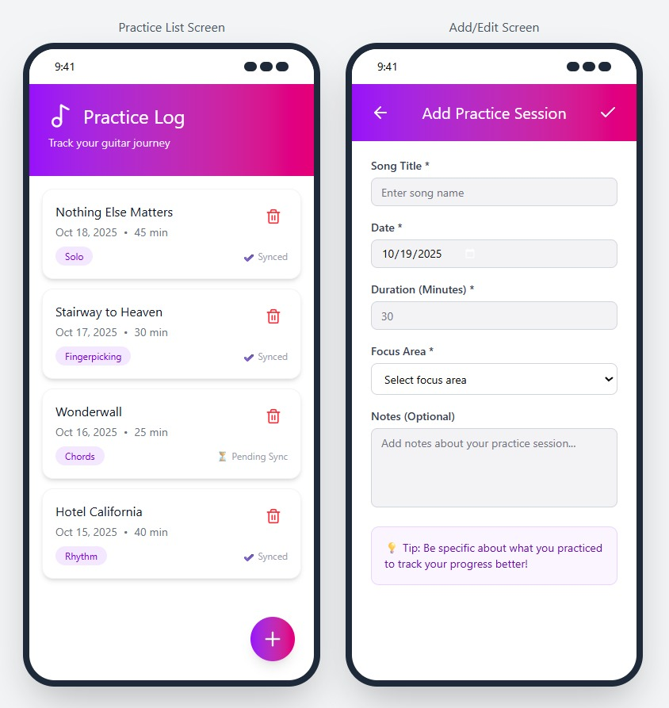

# 🎸 Guitar Practice Log Mobile App

## *Description*

The *Guitar Practice Log Mobile App* is a simple and intuitive tool designed for guitar players who want to keep track of their practice sessions. Each time users practice, they can quickly record the song they worked on, the date, the duration of the session, their focus area (like rhythm or chords), and optional notes about progress or difficulties.
The app helps users stay consistent, track improvement over time, and reflect on their learning journey. Even without an internet connection, the app remains fully functional, since all new sessions are saved locally and automatically synchronized with the server when the device reconnects.

---

## *Domain Details*

The app has a single main entity: *PracticeSession*. Each session represents one period of guitar practice and includes the following fields:

|                Field | Type    | Description                                                         |
| -------------------: | ------- | ------------------------------------------------------------------- |
|                 *ID* | Integer | A unique identifier for each practice session.                      |
|         *Song Title* | Text    | The name of the song or exercise practiced.                         |
|               *Date* | Date    | The day the practice took place.                                    |
| *Duration (Minutes)* | Number  | The length of the session, in minutes.                              |
|         *Focus Area* | Text    | The main technique or skill practiced (e.g., chords, rhythm, solo). |
|              *Notes* | Text    | Optional notes about progress, challenges, or goals.                |

---

## *CRUD Operations*

The app provides complete CRUD functionality (Create, Read, Update, Delete) for managing practice sessions:

| Operation | Description                                                                                                                                                                           | UI Location                                                    |
| --------: | ------------------------------------------------------------------------------------------------------------------------------------------------------------------------------------- | -------------------------------------------------------------- |
|  *Create* | Add a new practice session using the *Floating Action Button (+)*. This opens an input form where the user fills in all details and saves the session using the **checkmark button**. | Floating Action Button at the bottom-right of the main screen. |
|    *Read* | View all practice sessions in a list format. Tapping a session shows full details (song, duration, date, focus, notes).                                                               | Main list view and details page.                               |
|  *Update* | Edit a session by tapping it on the list. The form opens pre-filled with the existing details; the user updates the fields and saves using the **checkmark button**.                  | List item tap → edit form → checkmark button.                  |
|  *Delete* | Remove a session directly from the list.                                                                                                                                              | Trash can icon next to each session in the list.               |

---

## *Persistence and Offline Behavior*

The app uses two levels of data storage:

* *Online Server Database* – main data source when connected to the internet.
* *Local Database (Offline Cache)* – stores a local copy of all sessions, enabling full functionality even without an internet connection.

This hybrid model ensures smooth use in all situations: at home, in class, or on the go.

### ✅ *Online Mode*

When the device is connected:

* All CRUD operations (*Create*, *Read*, *Update*, *Delete*) are instantly synchronized with the online server.
* A local copy of each session is kept for offline access.
* If a server error occurs, the user is notified clearly.

### ⚙ *Offline Mode*

When the device is offline or the server cannot be reached:

|         Operation | Offline Behavior                                                                |
| ----------------: | ------------------------------------------------------------------------------- |
|    *Create (Add)* | Works normally. New sessions are stored locally and marked as “⏳ Pending Sync.” |
|     *Read (View)* | The app displays all locally stored sessions.                                   |
|   *Update (Edit)* | Works locally. Updated sessions are flagged as “Pending Update.”                |
| *Delete (Remove)* | Works locally. Deleted sessions are hidden and flagged as “Pending Deletion.”   |

---

## *🔄 Synchronization on Reconnection*

When the app reconnects to the internet:

1. All *new*, *updated*, and *deleted* sessions are automatically synced to the server.
2. Successfully synced records are marked as “✔ Synced.”
3. If any conflicts occur (e.g., server updates while offline), the user is notified and asked to confirm which version to keep.
4. The local database is refreshed with the most recent server data.

This ensures that users never lose their data and that local and server copies stay consistent.

---

## *Offline Scenarios*

Below are examples of what happens in each CRUD operation while offline:

### 🆕 *Create Example*

The user adds a new session for “Nothing Else Matters” while the internet is off.
The session is stored locally and appears in the list with a “⏳ Pending Sync” label.
Once reconnected, it’s automatically uploaded, and the label changes to “✔ Synced.”

### 📖 *Read Example*

The user opens the app on the subway without internet.
All previous practice sessions are still visible from the local database.

### ✏ *Update Example*

The user edits a past session to change the duration from 20 to 30 minutes.
The change is saved locally and marked “Pending Update.”
When the internet returns, the update is sent to the server automatically.

### 🗑 *Delete Example*

The user deletes an old session for “Smoke on the Water.”
It disappears from the list and is flagged for deletion.
After reconnection, it’s permanently removed from the server.

---

## *App Mockup*

---

## *Summary*

|        Feature |   Online  | Offline (cached)              |
| -------------: | :-------: | :---------------------------- |
|  View Sessions |     ✅     | ✅ (cached items)              |
|    Add Session |     ✅     | ✅ (stored locally until sync) |
| Update Session |     ✅     | ✅ (stored locally until sync) |
| Delete Session |     ✅     | ✅ (stored locally until sync) |
|      Data Sync | Automatic | Automatic when reconnected    |

---

This setup ensures that the *Guitar Practice Log Mobile App* remains reliable, intuitive, and motivating, even when users practice in places without internet access.
